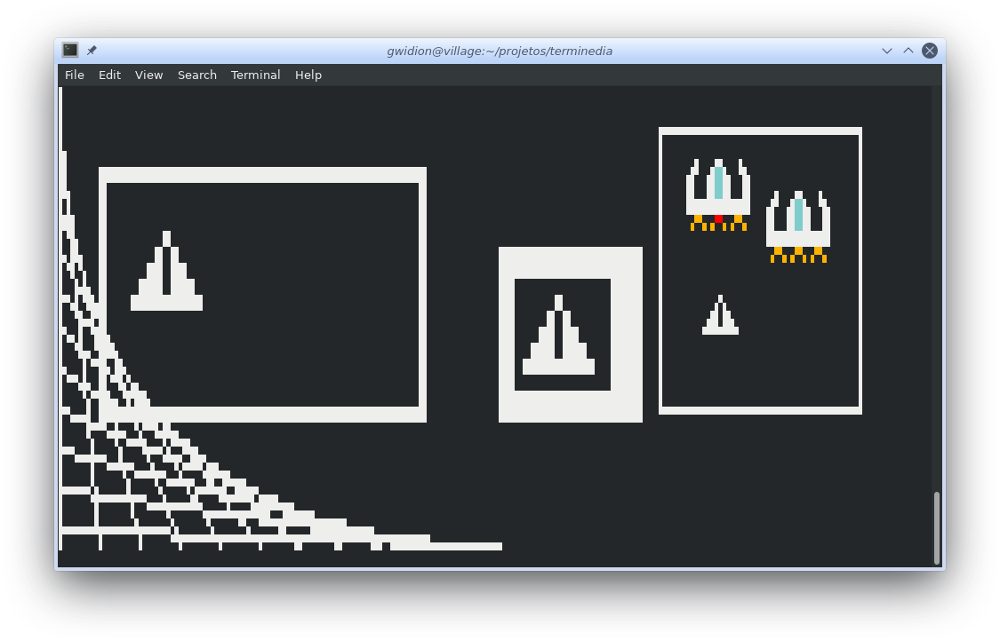
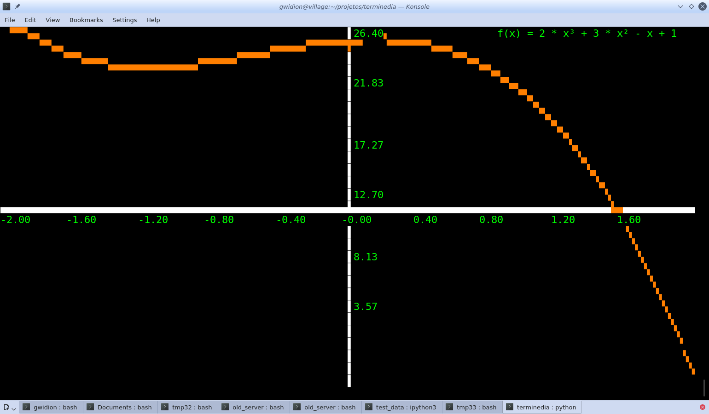
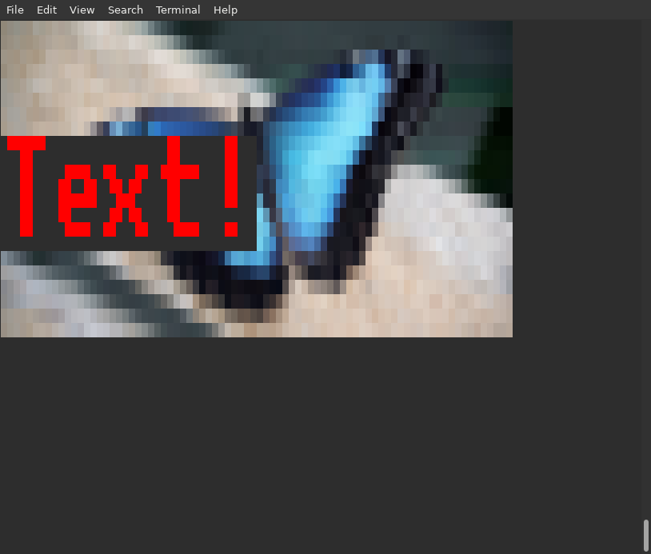

TERMINEDIA
===========

This is a Python library allowing using a text-terminal as a low-resolution graphics
output, along with keyboard realtime reading, and a couple utilities
enough to enable using a text terminal to run simple 2D games or simply rich terminal
apps.

The "noveau" factor is that it uses Unicode quarter-character block combinations
to effectivelly enable 1/4 character "pixels" in the terminal. It also makes
use of 24bit "true" color for text, not limiting itself to the 80's
8 color palette for the terminal.

The development version allows loading image files and displaying those
as colored block chars on the terminal, several terminal-font text effects,
and rendering big-text, 4 or 8 characters tall, by rendering
built-in fonts as images using block characters.

It is designed as a library, providing a discoverable and easy to
use API for drawing, and upon install a few example scripts
will be imediately available as stand-alone scripts
with the "terminedia-" prefix.

The idea is to keep this as a lightweight install - with
as little dependencies as possible.

Usage
-------

Although targeted for programatic use, after install a few example
programs exercising the library capabilities are made available
in the active Python environment. Try one of several "terminedia-xxxxx"
scripts installed, such as "terminedia-image" and "terminedia-snake"

Some of the features are as easy to use as the `print` function
from Python itself:

Other, like the drawing API which emulates pixels with unicode
block characters require a couple more calls:

Documentation
--------------

Check the in progress documentation at:
    https://terminedia.readthedocs.io/en/latest/

(nb. that documentation is currently for the 0.2 version,
available from pypi. The project's capabilities
evolved far beyond whats is in there, but docs are
still missing - the "TODO.txt" file lists implemented
features or fixes (marked with a "V") and a loose roadmap.
Although for useage and documentation one has to rely
on the doc-strings)

Also, the ``examples`` folder have concrete snippets and
some stress-testing code. The examples
were moved into the main package code, and granted stand-alone
scripts status when the package is pip-installed.

After install, try calling any of the `"terminedia-"` scripts
made available to check the output.

Although incipient in options, some of these example
scripts can work as command line tools. For example
`terminedia-image <image_file>` will downscale and display
an image file in the terminal.

Note that the default pip install won't bring PIL, which results in
limited image support - use `pip install terminedia[images]`,
or simply install PIL directly with `pip install pillow`,
to be able to load arbitrary image files.

Compatibility
--------------

Preliminary Windows support - by using the Colorama Python package,
with proper fonts configuration on the terminal, it is possible
to experiment most of terminedia´s capabilities (the terminedia-snake
example works).  There is still work to be done, but for a better
experience under Windows install the CMDER console emulator
and the UNSCII fonts for rendering pseudographics (links in the
FRIENDS.md file)

On Linux and other posix systems, Terminedia relies
on ANSI scape sequences for all terminal manipulation. It should work
in most Linux and Mac OS terminal applications (including non-X11,
"native" terminals on Linux)

The output result will vary according to the terminal
and font used - a nice experience can be achieved
with the "Terminus" font, specially if one is using
the Braille characters for drawing.

There is also an HTML backend that can output progrmatically
created ASCII art to an HTML file, formatted with
mono-spaced fonts inside a `div` element. The
"terminedia-image" example program makes use
of this feature.

License
--------
Terminedia is licensed under GNU's LGPL 3.0 or later, meaning you
are free to use it in whatver project you want, comercial or not,
private or not - you are only required to contribute back any
enhancements you make to this library itself.
For details, please read acompanining "LICENSE" file.
